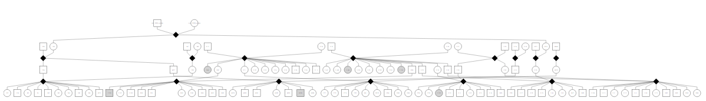

# d3-pedigree

Usage: open `index.html`

An interactive, complex pedigree viewer using d3. Click on marriage nodes, samples and links to "highlight" certain relationships -- this is advantageous in complicated pedigrees where the family lines are nearly guaranteed to overlap. 

The `d3-dagre` library is used to produce the underlying layout. Doing a pretty DAG layout that is optimized for human interpretability is not an easy task.

The use of diamond-shaped "marriage" nodes is controversial. I may change it. I just chose a default shape that didn't already have a clear meaning. 

This library is basically a prototype and hasn't been rigorously tested on edge cases. If you find something that breaks it, please email me at splichte@gmail.com. I'd be happy to take a look. 

